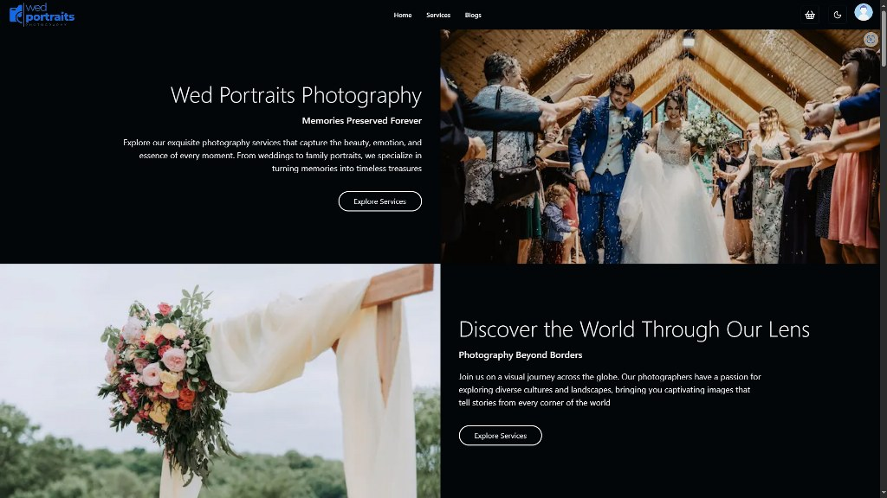

# Wed Portraits Photography



### It's a fullstack application using MERN stack and this is the frontend part of the application

**Live Link**: https://wed-portraits.vercel.app/

**Preview**: [YouTube](https://youtu.be/yaHh74SrBdM)

**Backend Repository**: https://github.com/mohammad-naimur-rahman/wed-portraits-server

### Library and tools used

**Library**: `Next js`

**UI and styling**: `Shadcn UI`, `Tailwind CSS`, `Sass`

**Type Safety**: `TypeScript`

**Icon Library**: `Lucid React`

**Form and validations**: `React Hook Form`, `Zod`, `Hookform Resolvers`

**Linting and prettifying**: `ESLint`, `Prettier`

**Pre commit checking**: `Husky`, `Lint Staged`

### Features

- [x] Login, signup method with strict password validation
- [x] Dashbaord based on user role
- [x] Fully mobile responsive for good user experience
- [x] S.O.L.I.D. Principles applied for good code readablity and reusablility
- [x] Handles loading, error, success state throughout the application to ensure robust user experience
- [x] Image optimization and used reusable code for better speed and performance

### Get started

#### 1. Clone the repository

```bash
git clone https://github.com/mohammad-naimur-rahman/wed-portraits-frontend
```

#### 2. Install the dependencies

```bash
yarn
```

#### 3. Setup the environment

Follow `.env.example` and give the necessary environment variables

#### 4. Run locally

```bash
yarn dev
```

#### 5. Trigger pre-commit hook (Optional)

```bash
yarn prepare
```

**Follow package.json for more scripts**

### Thanks for visiting this page, any queries or for contact me: [Naimur Rahman](https://www.linkedin.com/in/mohammad-naimur-rahman/)
